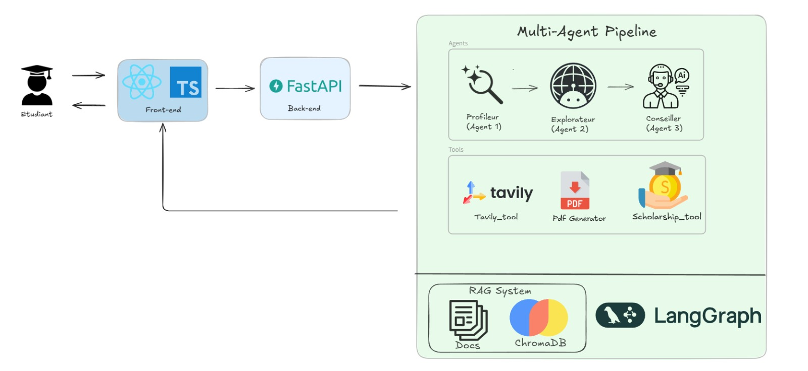

# 🎓 OrientAgent

> **Multi-Agent AI System for Moroccan Student Orientation**  
> Guiding students toward their ideal post-secondary path with intelligent analysis and personalized recommendations

---

## 📋 Table of Contents

- [🎯 Overview](#-overview)
- [✨ Key Features](#-key-features)
- [🏗️ Architecture](#️-architecture)
- [🤖 AI Agents](#-ai-agents)
- [🛠️ Tech Stack](#️-tech-stack)
- [🚀 Getting Started](#-getting-started)
- [📦 Project Structure](#-project-structure)
- [📡 API Documentation](#-api-documentation)
- [🧪 Testing](#-testing)
- [🌍 Environment Setup](#-environment-setup)

---

## 🎯 Overview

**OrientAgent** is a cutting-edge AI-powered orientation system designed to help Moroccan lycée students (baccalauréat holders) discover and navigate towards the most suitable post-secondary education paths. By leveraging multi-agent orchestration, RAG (Retrieval-Augmented Generation), and advanced LLM capabilities, OrientAgent provides data-driven guidance personalized to each student's academic profile, interests, and career aspirations.

**Target Users:** Moroccan students, educators, and education counselors  
**Coverage:** 40+ verified Moroccan filières (educational programs)

---

## ✨ Key Features

| Feature | Description |
|---------|-------------|
| 📊 **Profile Analysis** | Intelligent scoring across multiple academic domains with customizable weighting algorithms |
| 🔍 **RAG-Powered Search** | Semantic similarity search over 40+ verified Moroccan filières with ChromaDB |
| 🎯 **Smart Recommendations** | Generates top 3 personalized filière recommendations with explicit action plans |
| 📄 **PDF Reports** | Download comprehensive, personalized orientation guidance documents |
| ⚡ **Real-Time Updates** | Server-Sent Events (SSE) streaming for live progress tracking |
| 🌐 **Bilingual Support** | French interface with extensible internationalization |
| 📱 **Responsive Design** | Mobile-first Next.js frontend with TailwindCSS styling |

---

## 🏗️ Architecture


---

## 🤖 AI Agents

### 1️⃣ **Profileur** (Profile Analysis Agent)
- **Role:** Analyzes student academic profile
- **Input:** Baccalauréat series, grades, interests, career aspirations
- **Output:** Domain scores (science, humanities, technical, etc.), learning style assessment
- **Scoring:** Weighted formula based on Bac series with interest-based adjustments

### 2️⃣ **Explorateur** (Search & Retrieval Agent)
- **Role:** Discovers relevant filières using semantic search
- **Input:** Domain scores and student constraints
- **Output:** 10-15 semantically similar filières from corpus
- **Powers:** 
  - 🔍 ChromaDB semantic retrieval
  - 💼 Tavily API for real-time employment data enrichment
  - 🎨 Enhanced LLM-powered result formatting

### 3️⃣ **Conseiller** (Recommendation Agent)
- **Role:** Ranks filières and generates personalized guidance
- **Input:** Retrieved filières + student profile
- **Output:** Top 3 recommendations with detailed justifications + action plans
- **Intelligence:** Custom scoring algorithm balancing compatibility, accessibility, and career outcomes

---

## 🛠️ Tech Stack

### **Backend**
```
Tag: Python | FastAPI | LangChain | LangGraph
```
- **Framework:** FastAPI 0.115+ (async Python web framework)
- **AI Orchestration:** LangGraph 0.2+ (multi-agent workflow engine)
- **LLM Integration:** LangChain 0.3+ with GROQ provider
- **Vector Store:** ChromaDB 0.5+ (embedded vector database)
- **Embeddings:** Sentence Transformers (all-MiniLM-L6-v2)
- **External APIs:** Tavily Python SDK (employment data)
- **PDF Generation:** ReportLab 4.2+
- **Async Support:** HTTPX, aiofiles
- **Database:** SQLite (session persistence)

### **Frontend**
```
Tag: React | Next.js | TypeScript | TailwindCSS
```
- **Framework:** Next.js 15+ (React SSR/SSG)
- **Styling:** TailwindCSS 3+ (utility-first CSS)
- **Language:** TypeScript (type safety)
- **State Management:** React Hooks + Context API
- **Build Tool:** Next.js built-in Webpack
- **Package Manager:** npm / yarn

### **Infrastructure**
- **Runtime:** Python 3.9+, Node.js 18+
- **Environment:** Docker-ready, cross-platform (Windows/Linux/Mac)
- **Testing:** pytest + pytest-asyncio
- **API Docs:** FastAPI auto-generated with Swagger & ReDoc

---

## 🚀 Getting Started

### Prerequisites
```bash
# Python 3.9+ and Node.js 18+
python --version
node --version
npm --version
```

### 1. **Clone & Setup**
```bash
# Clone the repository
git clone <repository-url>
cd OrientAgent

# Create Python virtual environment
python -m venv venv

# Activate virtual environment
# On Windows:
venv\Scripts\activate
# On macOS/Linux:
source venv/bin/activate
```

### 2. **Install Dependencies**
```bash
# Install Python dependencies
pip install -r requirements.txt

# Install frontend dependencies
cd frontend
npm install
cd ..
```

### 3. **Configure Environment**
```bash
# Create .env file in project root
cp .env.example .env

# Update .env with your credentials:
# - GROQ_API_KEY (get from https://console.groq.com)
# - TAVILY_API_KEY (get from https://tavily.com)
# - FRONTEND_URL (default: http://localhost:3000)
```

### 4. **Initialize RAG Database**
```bash
# Index the filières corpus into ChromaDB
python rag/indexer.py

# Expected output:
# ✓ Indexed XX filières from corpus
# ✓ ChromaDB collection created successfully
```

### 5. **Run Development Servers**

**Terminal 1 - Backend:**
```bash
python -m api.main

# Expected output:
# 🚀 Starting OrientAgent API...
# ✓ ChromaDB found at ./rag/chroma_db
# ✓ LangGraph compiled successfully
# ✓ Data directories ready
# ✅ OrientAgent API ready!
# INFO: Uvicorn running on http://127.0.0.1:8000
```

**Terminal 2 - Frontend:**
```bash
cd frontend
npm run dev

# Expected output:
# ▲ Next.js 15.1.0
# - Local: http://localhost:3000
```

### 6. **Access Application**
- 🌐 Frontend: [http://localhost:3000](http://localhost:3000)
- 📚 API Docs: [http://localhost:8000/docs](http://localhost:8000/docs)
- 🔧 ReDoc: [http://localhost:8000/redoc](http://localhost:8000/redoc)

---

## 📦 Project Structure

```
OrientAgent/
│
├── 📂 agents/                      # Multi-agent logic
│   ├── advisor.py                 # Conseiller agent
│   ├── explorer.py                # Explorateur agent
│   ├── profiler.py                # Profileur agent
│   ├── logic/
│   │   ├── advisor_scoring.py
│   │   ├── explorer_utils.py
│   │   └── profiler_scoring.py
│   └── static/                    # Agent prompts
│       ├── advisor_prompt.py
│       ├── explorer_prompt.py
│       └── profiler_prompt.py
│
├── 📂 api/                        # FastAPI server
│   ├── main.py                    # Entry point
│   ├── schemas.py                 # Pydantic models
│   ├── sse.py                     # Server-Sent Events
│   └── routers/
│       └── session.py             # Session endpoints
│
├── 📂 graph/                      # LangGraph workflow
│   ├── graph.py                   # Graph builder
│   ├── nodes.py                   # Workflow nodes
│   └── state.py                   # State definitions
│
├── 📂 rag/                        # Retrieval-Augmented Generation
│   ├── indexer.py                 # ChromaDB indexer
│   ├── retriever.py               # RAG retrieval logic
│   ├── corpus/                    # Filière corpus JSON
│   │   ├── ehtp.json
│   │   ├── emi.json
│   │   ├── ensam.json
│   │   └── ... (40+ institutions)
│   └── chroma_db/                 # Vector store (auto-generated)
│
├── 📂 pdf/                        # PDF generation
│   └── generator.py               # ReportLab reports
│
├── 📂 tools/                      # External integrations
│   ├── chromadb_tool.py           # ChromaDB wrapper
│   ├── scholarship_tool.py        # Scholarship data
│   └── tavily_tool.py             # Tavily API wrapper
│
├── 📂 frontend/                   # Next.js application
│   ├── app/
│   │   ├── page.tsx               # Homepage
│   │   ├── layout.tsx             # Root layout
│   │   ├── interview/             # Interview page
│   │   ├── onboarding/            # Student profile form
│   │   └── results/               # Results dashboard
│   ├── package.json
│   ├── next.config.js
│   ├── tailwind.config.ts
│   └── tsconfig.json
│
├── 📂 data/                       # Data storage
│   └── reports/                   # Generated PDF reports
│
├── 📂 tests/                      # Test suite
│   ├── test_agents.py
│   ├── test_api.py
│   └── test_rag.py
│
├── 🔧 pytest.ini                  # Pytest configuration
├── 📋 requirements.txt             # Python dependencies
├── 🔐 .env                        # Environment variables (create from .env.example)
└── 📄 README.md                   # This file
```

---

## 📡 API Documentation

### **Health Check**
```
GET /health
Response: { "status": "healthy", "version": "1.0.0" }
```

### **Create Session**
```
POST /api/session/create
Content-Type: application/json

{
  "nom": "Ahmed",
  "serie_bac": "S",
  "moyennes": {"math": 18, "physics": 17, ...},
  "interet_domaines": ["informatique", "ingénierie"]
}
```

### **Stream Results (SSE)**
```
GET /api/session/{session_id}/stream

Event stream:
- "progress" – Workflow stage updates
- "recommendations" – Final recommendations
- "error" – Error notifications
```

### **Download Report**
```
GET /api/session/{session_id}/download-pdf

Response: PDF file (application/pdf)
```

---

## 🧪 Testing

### **Run All Tests**
```bash
# Run full test suite
python -m pytest tests/ -v

# Run with coverage
python -m pytest tests/ --cov=agents --cov=api --cov=graph

# Run specific test file
python -m pytest tests/test_agents.py -v
```

### **Test Structure**
- `tests/test_agents.py` - Agent logic & scoring functions
- `tests/test_api.py` - FastAPI endpoints
- `tests/test_rag.py` - RAG retrieval & indexing

---

## 🌍 Environment Setup

### **Required Environment Variables**

```bash
# .env file (create in project root)

# LLM Configuration
GROQ_API_KEY=gsk_...                    # Get from https://console.groq.com
GROQ_MODEL=mixtral-8x7b-32768           # Model name

# Tavily API (optional, for employment data)
TAVILY_API_KEY=...                      # Get from https://tavily.com

# Application
FRONTEND_URL=http://localhost:3000
CHROMA_DB_PATH=./rag/chroma_db
SQLITE_DB_PATH=./data/orient_agent.db

# Optional
DEBUG=false
LOG_LEVEL=INFO
```

### **API Key Setup**

1. **GROQ API Key**
   - Visit [https://console.groq.com](https://console.groq.com)
   - Sign up / Login
   - Generate API key
   - Copy to `.env` as `GROQ_API_KEY`

2. **Tavily API Key** (optional)
   - Visit [https://tavily.com](https://tavily.com)
   - Sign up / Login
   - Generate API key
   - Copy to `.env` as `TAVILY_API_KEY`

---

## 🎯 Usage Example

### **Student Journey**

```
1. Student visits http://localhost:3000
   ↓
2. Completes onboarding (profile, grades, interests)
   ↓
3. Backend processes through LangGraph:
   - Profileur analyzes profile
   - Explorateur retrieves matching filières
   - Conseiller ranks options
   - PDF Generator creates report
   ↓
4. Frontend streams updates via SSE
   ↓
5. Student receives top 3 recommendations + action plan
   ↓
6. Downloads personalized PDF report
```


---


<div align="center">

**⭐ Empower Moroccan students to find their ideal educational path with AI ⭐**

</div>
